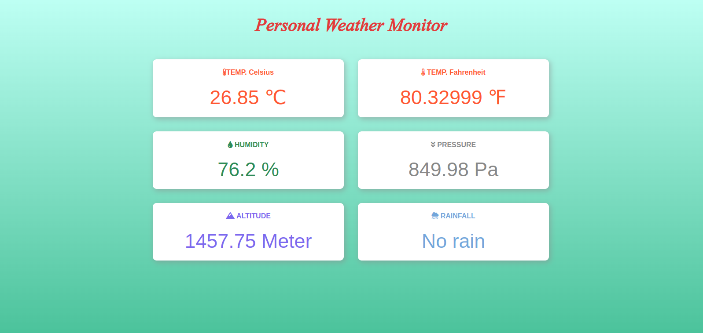

# Raspberry Pi Pico W

This project involves building a personal weather station using a Raspberry Pi Pico W and several sensors including a raindrop sensor, BMP180, and DHT22. The weather station monitors various weather parameters including rainfall, temperature, humidity, pressure, and altitude. This project enables the user to collect real-time weather data and provides an opportunity to analyze and understand the local weather patterns in detail.

### weatherStation.py
- Sample output:

```
		Values obtained at 2023-03-18 17:28:58 : 
**********DHT22************
Temperature: 25.9 °C
Humidity: 68.6 %
**********BMP180************
Temperature:  26.9 °C
Temperature:  80.42 F
Atm. Pressure: 847.73 hPa
Altitude: 1479.364 meters
**********RAINDROP************
No rain
54669
```

### weatherStation_Web.py
- `weatherStation_Web.py` is an updated version of `weatherStation.py`.
- It displays the realtime weather data on a web page hosted in the Raspberry pi pico W server.



### WUstation.py
- In this script, i have updated the `weatherStation_Web.py`.
- The code connects to the WiFi, reads data from the sensors, uploads the data to Weather Underground, and also displays it on a webpage hosted on the Raspberry Pi server.

Here's a brief overview of the code:

- Import required libraries.
- Set up the WiFi network name (SSID) and password.
- Initialize the onboard LED and I2C bus for communication with the sensors.
- Connect to the WLAN and wait until the connection is successful.
- Define a function upload_to_wu to upload the weather data to Weather Underground.
- Define a function web_page to create an HTML page displaying the weather data.
- Set up the server socket to listen for incoming connections.
- In the main loop, accept connections, receive requests, and send the generated HTML page as a response.

## WUstation2.py 
- In this updated version of `WUstation.py`, i have included data logging feature such that the weather data is stored in weather_data.csv every 30 seconds.
- However this would not be the best approach to do this since the Raspberry pi pico W only has a total of 2MB flash memory which is used to store even the scripts, thus not enough to handle a large csv file.